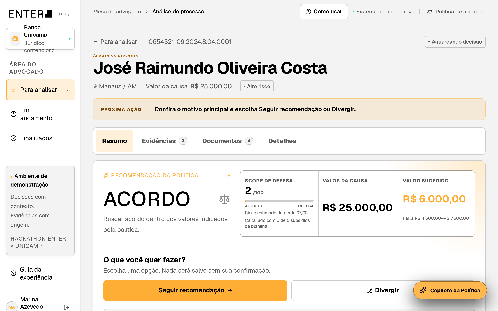
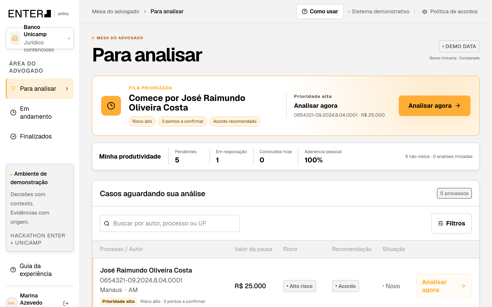
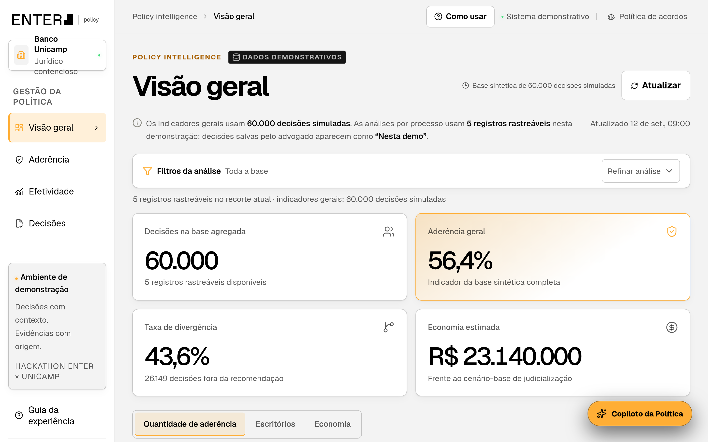
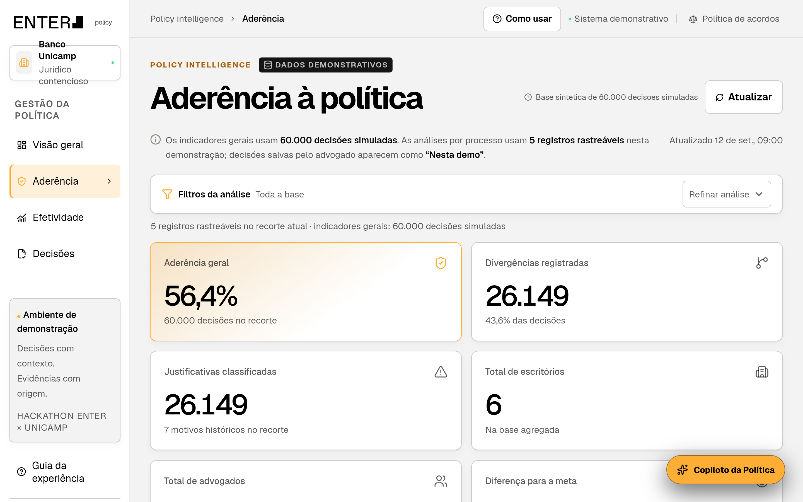
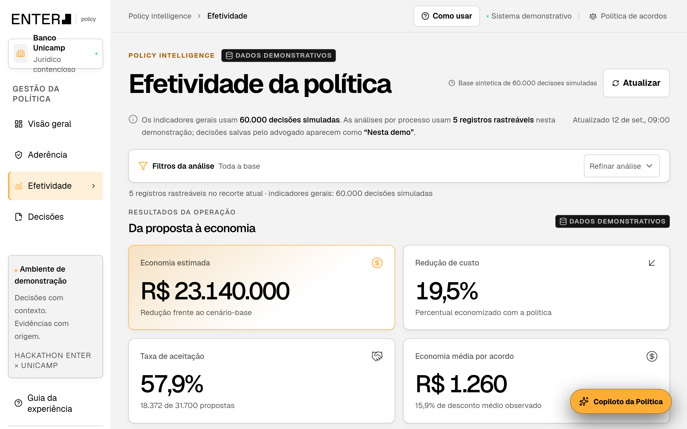

<h1 align="center">Enter Policy</h1>

<p align="center">
  <strong>Política de acordos com inteligência para o contencioso bancário</strong><br>
  Hackathon Enter × Unicamp 2026 · Equipe Shift Happens
</p>

<p align="center">
  <a href="https://github.com/decarvalho33/shift_happens/actions/workflows/ci.yml"></a>
  
  
  
  
  
  
</p>

<p align="center">
  
</p>

| 🎬 Vídeo | 📊 Apresentação | ⚙️ Instalação | 📈 Modelos | 🧭 Decisões |
| :---: | :---: | :---: | :---: | :---: |
| _adicionar link_ | [`docs/`](docs/README.md) | [`SETUP.md`](SETUP.md) | [`docs/modelos.md`](docs/modelos.md) | [`docs/DECISOES.md`](docs/DECISOES.md) |

---

## O problema

O Banco Unicamp recebe cerca de **15 mil processos novos por mês**, e **5 mil** vêm de consumidores que dizem não reconhecer um empréstimo. Em cada um, o advogado externo decide entre defender o banco ou propor um acordo. Na base histórica do desafio:

| 60.000 processos | R$ 192,98 milhões pagos | 0,47% em acordo | 30,1% de derrotas | 69,4% alegam golpe |
| :---: | :---: | :---: | :---: | :---: |
| sentenças analisadas | em condenações e acordos | só 280 casos | nas sentenças | sub-assunto “golpe” |

Quase todo o dinheiro saiu em condenações, e o acordo praticamente não foi usado. O enunciado completo está em [`docs/desafio.txt`](docs/desafio.txt).

## A solução

**Mesa do advogado.** Cada processo chega com a recomendação da política, o **score de defesa**, o valor sugerido e as evidências com documento e página de origem. O advogado segue a recomendação ou diverge com justificativa, e registra a negociação.

**Modelos treinados na base.** A taxa de risco calcula a chance de perder a partir dos subsídios juntados, do sub-assunto e da UF. O score de defesa vai de **0 (fechar acordo)** a **100 (pode defender)**. Também há modelos do valor da condenação e do valor típico de acordo.

**Visão administrativa.** Dashboards de aderência e efetividade acompanham decisões, divergências, negociações e economia.

**Copiloto e agente de usabilidade.** Um copiloto com OpenAI explica cada caso a partir dos dados do servidor. Um agente com Playwright simula um advogado sem treinamento e avalia a experiência.

| Fila do advogado | Visão geral |
| :---: | :---: |
|  |  |
| **Aderência** | **Efetividade** |
|  |  |

## Como o score funciona

```
soma      = intercepto + pesos dos subsídios juntados + peso do golpe + efeito da UF
P(perda)  = 1 / (1 + e^(−soma))
score     = 100 × (1 − P(perda))
```

| Informação do processo | Peso | Efeito médio na chance de perder |
| --- | ---: | ---: |
| Contrato juntado | −3,08 | −44,9 p.p. |
| Extrato juntado | −3,00 | −41,6 p.p. |
| Comprovante de crédito juntado | −1,27 | −12,7 p.p. |
| Demonstrativo da dívida juntado | −0,52 | −5,0 p.p. |
| Alegação de golpe | +1,02 | +9,3 p.p. |
| UF | −0,46 (MA) a +0,83 (AP) | — |

O score é a chance de o banco ganhar e é calibrado: onde ele fica entre 81 e 95, o banco ganhou 90,6% das vezes. O site faz a mesma conta do Python, com os mesmos coeficientes.

## Resultados dos modelos

| Modelo | Resultado | Como foi escolhido |
| --- | --- | --- |
| [Taxa de risco](src/modelo/taxa_de_risco/README.md) | AUC **0,923** · maior desvio de calibração **0,5 p.p.** | Validação cruzada contra tábuas, interações e árvores |
| [Valor da condenação](src/modelo/condenacao/README.md) | RMSE **R$ 3.723** · R² **0,544** | Melhor entre **64** configurações |
| [Valor de oferta](src/modelo/valor_oferta/README.md) | **29,8%** da causa · faixa de 80% entre 21,6% e 38,6% | Bootstrap com 1.000 reamostragens contra 11 candidatos |

## Como executar

Com Node.js 22.12 ou superior:

```bash
cd src/frontend
npm ci
npm run dev
```

Abra `http://127.0.0.1:5173`, clique em **Entrar como Advogado** e abra um processo. Não precisa de chave, banco de dados ou backend. Copiloto com OpenAI, modelos, gerador de dados e agente estão no [`SETUP.md`](SETUP.md).

<details>
<summary><strong>Rotas principais</strong></summary>

```text
/                         seleção de perfil
/minha-fila               processos para analisar
/em-andamento             processos em negociação
/finalizados              processos concluídos
/processos/:caseId        análise, score, decisão e negociação
/admin/overview           visão administrativa
/admin/adherence          monitoramento de aderência
/admin/effectiveness      monitoramento de efetividade
/admin/decisions          registro de decisões
```

</details>

## Estrutura

```text
src/
├── frontend/               aplicação React: mesa do advogado, dashboards e score (src/lib/riskModel.ts)
├── backend/                API do copiloto integrada à OpenAI
├── modelo/                 taxa de risco, valor da condenação e valor de oferta
├── usability-agent/        agente de avaliação de UX com Playwright
├── synthetic_adherence.py  gerador da camada sintética de aderência
└── tests/                  testes do gerador
data/                       planilha do desafio e snapshot agregado
docs/                       enunciado, modelos, decisões e apresentação
SETUP.md                    instalação e execução
```

## Stack

| Camada | Tecnologias |
| --- | --- |
| Frontend | React 19 · TypeScript 6 · Vite 8 · React Router · Radix UI · Lucide |
| Backend | Node.js · TypeScript · OpenAI Responses API · Structured Outputs |
| Modelos | Python 3.10+ · pandas · NumPy · scikit-learn |
| UX | Playwright · OpenAI (visão) |
| Qualidade | Vitest · Testing Library · Oxlint · GitHub Actions |

<details>
<summary><strong>Testes</strong></summary>

Rodam a cada push no GitHub Actions.

```bash
cd src/frontend && npm run lint && npm test && npm run build
cd src/backend && npm run check && npm test
python -m unittest discover -s src/tests
cd src/usability-agent && python -m unittest discover -s tests
```

</details>

## Requisitos do desafio

| # | Requisito | Onde está |
| :---: | --- | --- |
| 1 | Regra de decisão | Score de defesa em [`riskModel.ts`](src/frontend/src/lib/riskModel.ts), treinado em [`taxa_de_risco`](src/modelo/taxa_de_risco/README.md) |
| 2 | Sugestão de valor | Valor sugerido e faixa na página do processo; referência de acordo em [`valor_oferta`](src/modelo/valor_oferta/README.md) |
| 3 | Acesso à recomendação | Página do processo em [`WorkspacePage.tsx`](src/frontend/src/pages/WorkspacePage.tsx) |
| 4 | Monitoramento de aderência | Aba Aderência em [`AdminPage.tsx`](src/frontend/src/pages/AdminPage.tsx) |
| 5 | Monitoramento de efetividade | Aba Efetividade em [`AdminPage.tsx`](src/frontend/src/pages/AdminPage.tsx) |

## Limitações e próximos passos

- **A base diz se o documento foi juntado, não o que ele conclui.** Próximo passo: ler o conteúdo dos subsídios com IA (veredito do dossiê, conta que recebeu o crédito).
- **Os limiares do score ainda não viraram regra.** O ponto de equilíbrio entre o acordo típico e a condenação esperada fica em score ≈ 58.
- **Não há custo de defesa, datas nem histórico de negociação na base.** Registrar propostas e respostas na plataforma permite aprender a chance de aceite.
- **Recomendação, faixa de acordo e indicadores administrativos são demonstrativos.** O score já vem do modelo. As premissas estão em [`docs/DECISOES.md`](docs/DECISOES.md).

<p align="center"><sub>Protótipo demonstrativo. Casos, nomes e valores exibidos na interface são fictícios.</sub></p>
